# The Tempo of PTA
Data Essay for PTA mini project

## Intro

My aim for this project is to visualize the tempo of each of PTA's films by comparing and compiling data on shot, scene, and movie lengths. Creating a comprehensive breakdown of tempo in each of PTA's films will allow the PTA-annotated project to bolster its annotations. Below are two essays written on film tempo and the important role it plays in audience perception of time in film:

[View Impact of Shot Length and Motion on Cinematic Tempo](https://kth.diva-portal.org/smash/get/diva2:1704346/FULLTEXT01.pdf) essentially explains the role of tempo in film and also conduct their own study of action films. The conclusion the essay reached was that when shot lengths are shorter, the viewer will perceive the film as having a higher tempo. 

[View Study of Shot Length and Motion as Contributing Factors to Movie Tempo](https://dl.acm.org/doi/pdf/10.1145/354384.354530) conducts a study to demonstrate how tempo is used by filmmakers. The study tests the ability of machine learning to see if the machine learning is able to gain important information on the film. The study was successful and thus, the authors conclude that shot length and motion can be employed not only to change the tempo of a film but also to convey meaningful information to its viewers. 

Having a part of the PTA-annotated website dedicated to tempo would not only help to improve viewers' understanding of the inner workings of film but also may provide them further insight on the messages of the films. 

## The Data

I have already begun to compile data from the PTA annotations by calculating the length of each scene in PTA's films. I used the scene-list time stamps chosen by the PTA team and converted each scene length to seconds. It's worth mentioning that the calculated scene lengths are not accurate to the films themselves due to a multitude of factors: scenes with many screenshots (lots of camera changes, motion, etc) typically were made shorter to make the screenshoter's job easier; the scenes were given more equal divisions to make work easier to divide amongst screenshoters; etc. 

From this data, I calculated the average length of all scenes in PTA's films, the average length of each scene of every individual film, and the longest/shortest scene/movie.

### Data Visualizations Thus Far

Below are some of the graphs I've made so far:

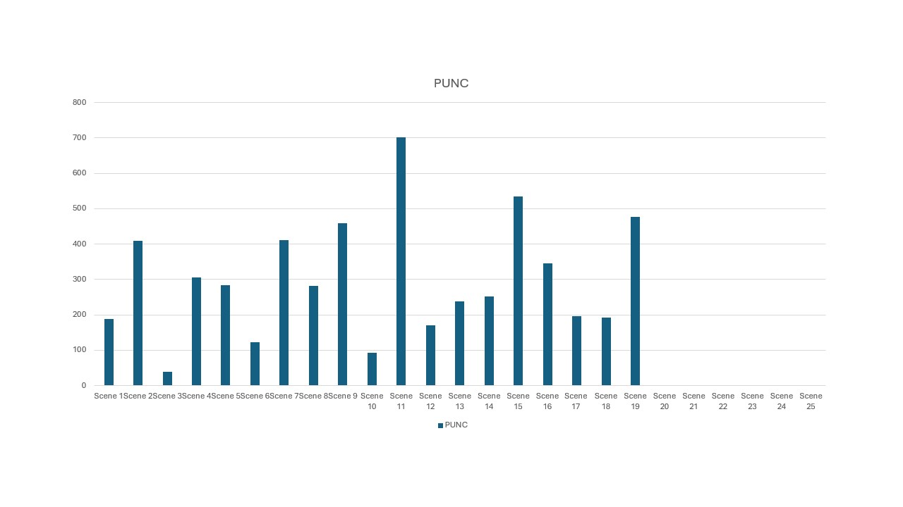 
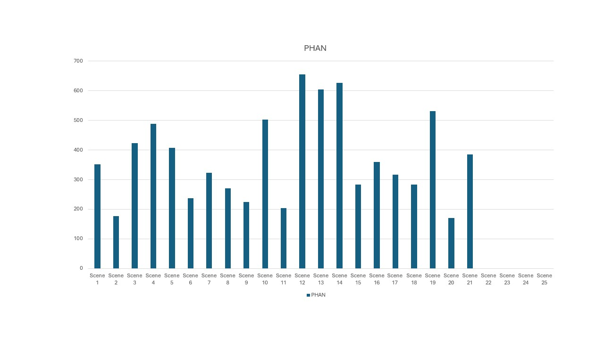
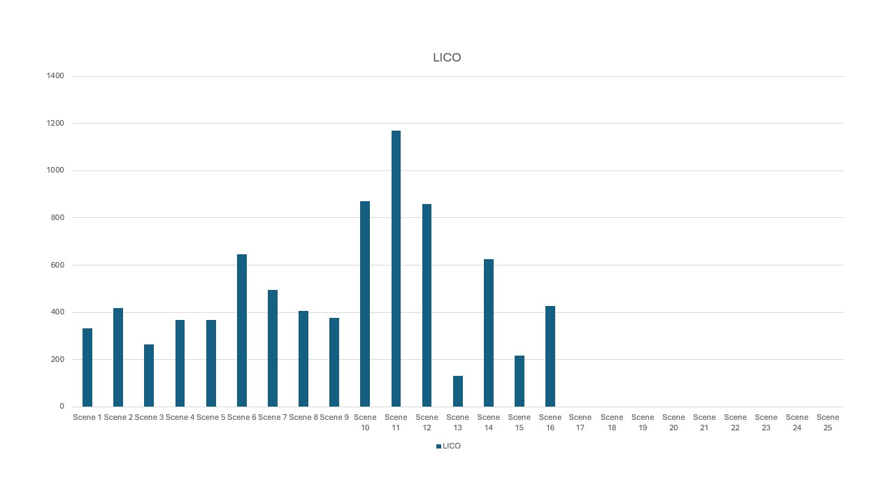
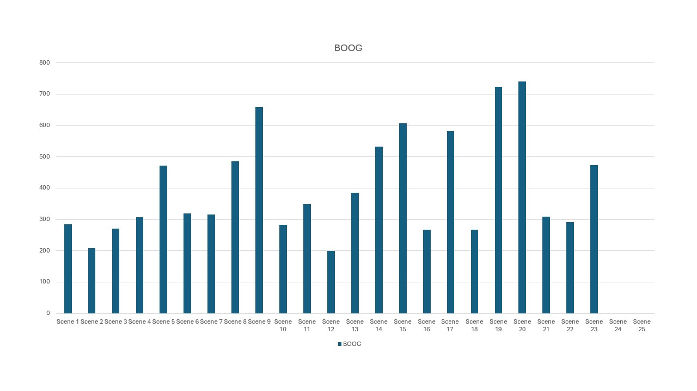
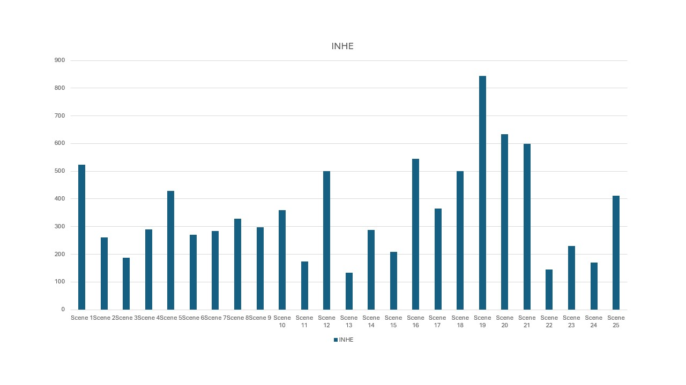
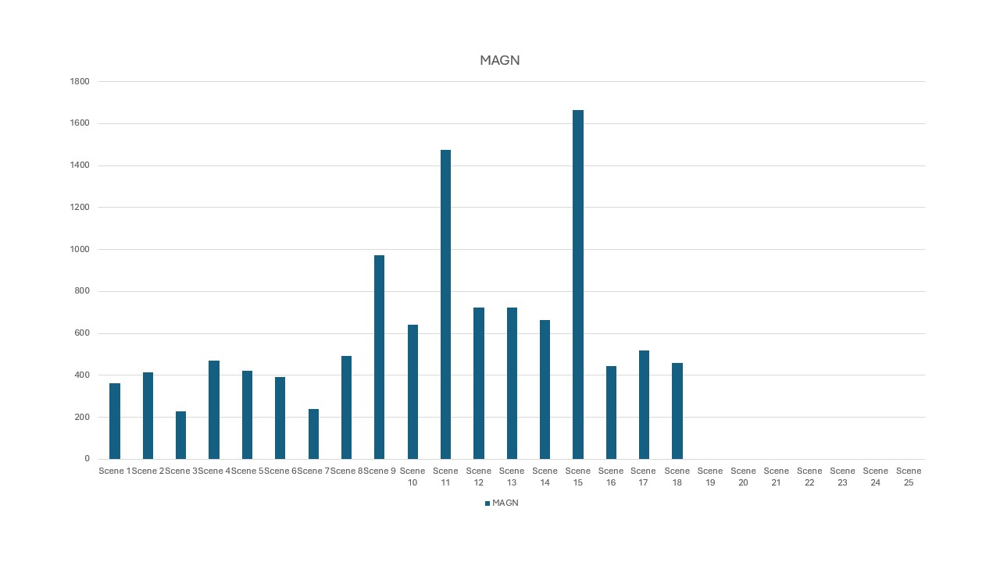
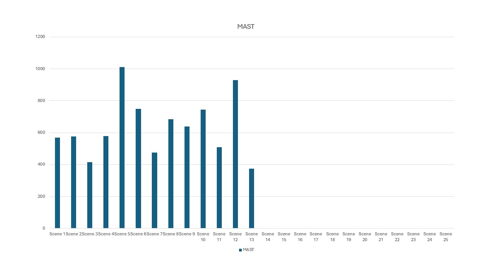
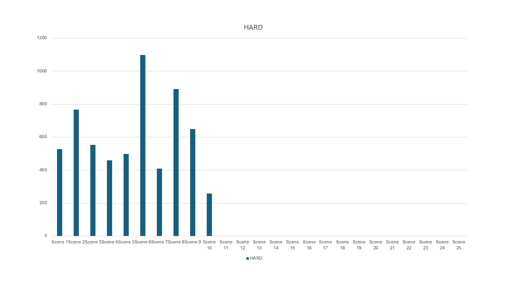
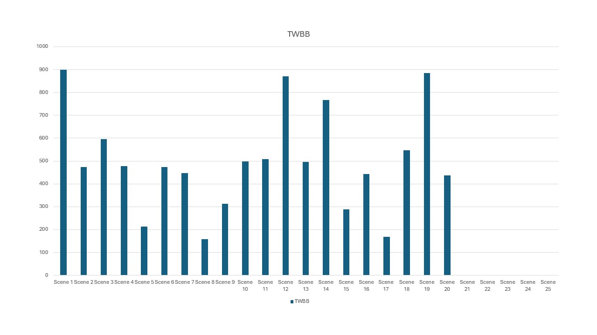
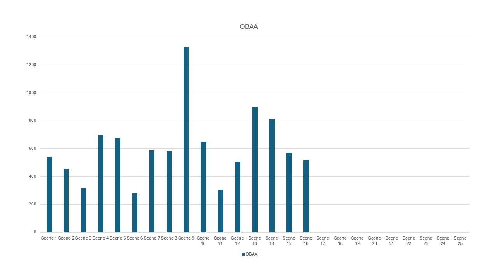
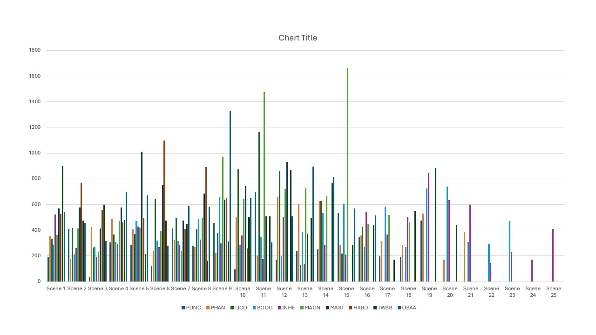
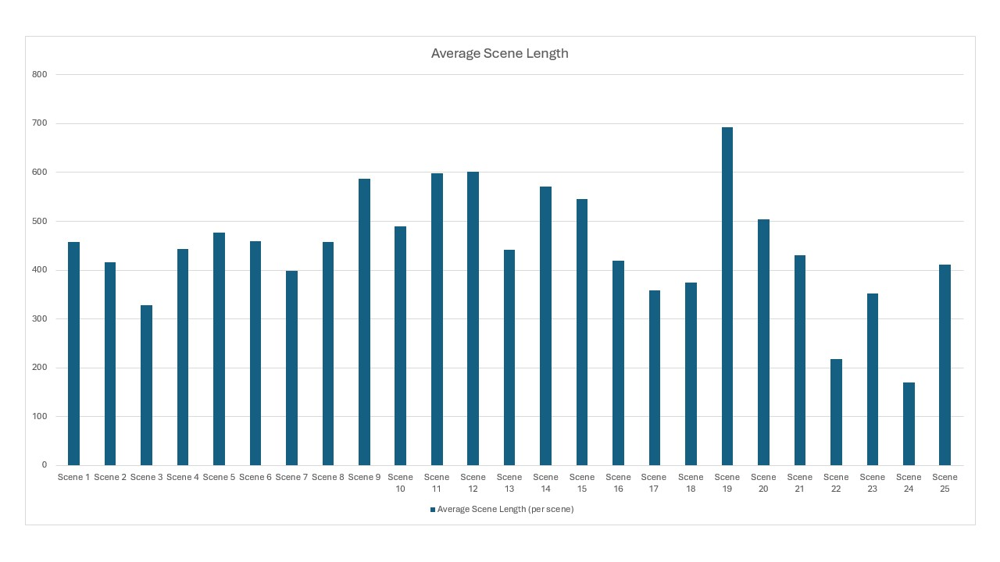

I think these graphs are interesting because they are representative of the different opinions of what constitutes as a scene in the opinion of the people diviying them up. I also think that given more data we could start to develop some interesting analysis of trends in film length affecting number of scenes and length of scenes, etc. 

## Future Data Visualizations

Below are some hand-drawn graphs I hope to create if I continue on with this project:

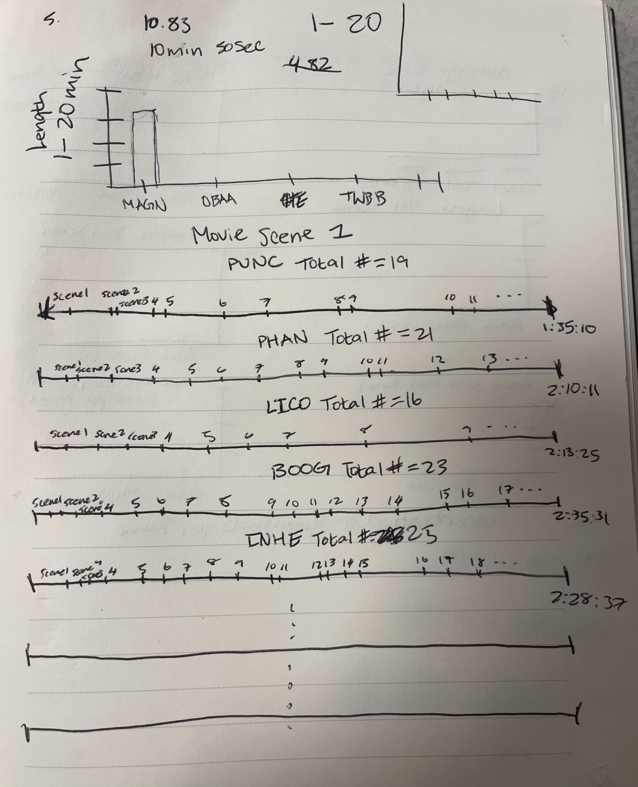
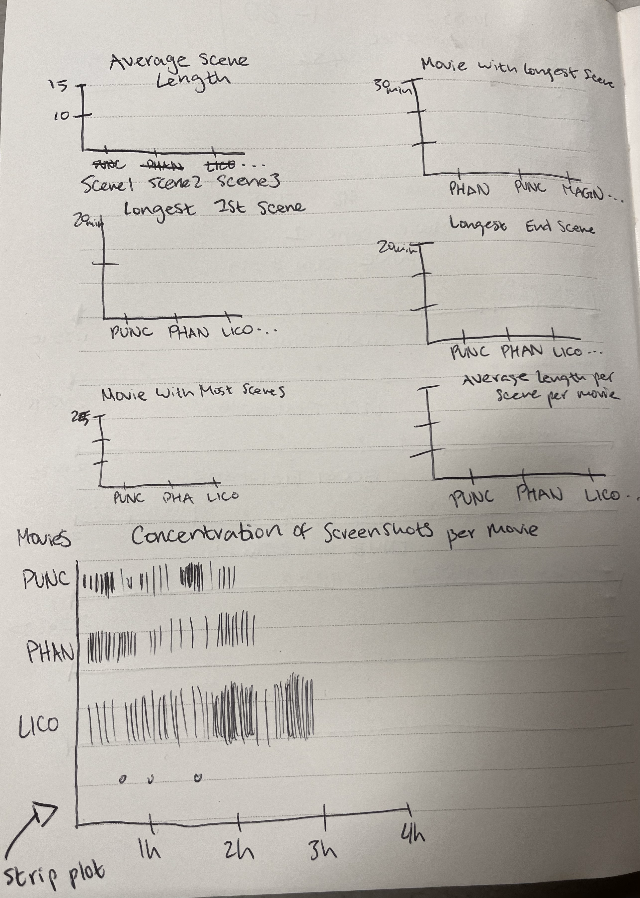
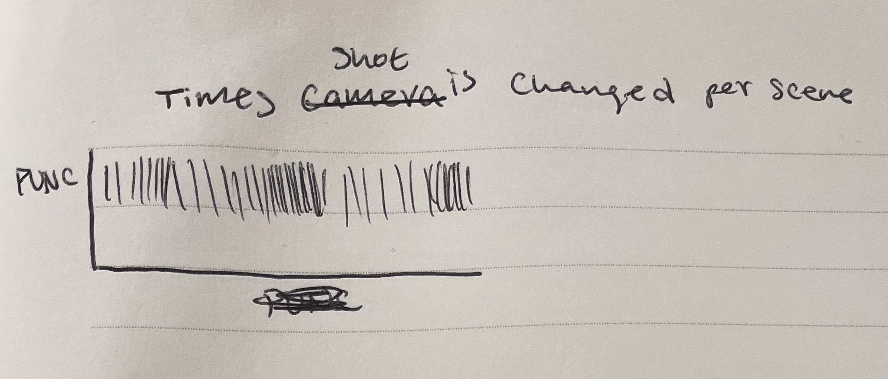

